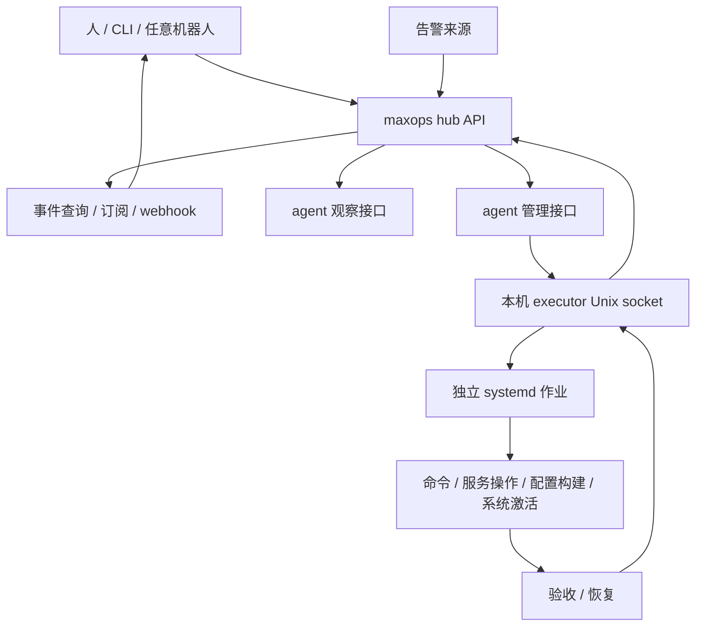

# maxops 命令执行与配置部署实现计划

日期：2026-09-06。基线：0.2.1 / `f7a2f73`。

状态：已完成。P0 协议与存储、P1 异步命令、P2 服务操作、P3 配置工作区、
P4 构建部署、P5 事件诊断与修复协调、P6 通用客户端与升级路径均已实现。
最终源码快照通过 macOS devenv 门禁、Linux Nix 构建内 62 个 nextest 测试，
以及 b650 上由 KVM 执行的完整 NixOS VM 验收。

## 1. 已确定的产品边界

maxops 是独立的运维服务。人、CLI、任意机器人和自动化程序使用相同的协议。
它自己保存作业、事件、配置变更与部署记录；不依赖 Max 的数据库、任务系统、
QQ 群模型、提示词或消息投递实现。机器人负责推理和选择下一步，maxops 提供
可执行、可追踪、可恢复的操作。通知接收端通过通用接口集成。

maxops 是 fleet 的多个修改入口之一。人可以手动推送提交、rebuild、切换 generation、
操作服务，也可以使用其他部署工具。它不拥有整个 fleet 的唯一写入权，不要求
外部操作经过自己的 API；自己的部署历史也不等于主机的完整变更历史。

本轮采用可信管理客户端模型：

- 客户端凭据分为观察与管理两档，并限定可访问的主机和仓库。
- 管理客户端在预授权范围内自动执行，无须逐命令确认。
- 聊天入口的群白名单由对应机器人管理，maxops 不接受模型填写的群身份作为授权依据。
- 运维重心是执行可靠性：异步作业、重复请求、并发修改、状态恢复、部署验收。
- 初版不引入企业级 RBAC、人员审批流或逐条命令正则白名单。
- 完整主机管理权限是显式的管理员级授权；默认观察客户端不会自动获得该权限。

这项决定更新了 [architecture.md](architecture.md#before-mutations) 中未来变更操作
的确认方式：管理凭据和服务端策略承担预授权，保留不可变操作参数、执行前校验、
幂等键、持久记录和未知结果核对。当前 0.2 的只读行为保持不变。

## 2. 当前代码与需要补齐的部分

| 位置 | 已有能力 | 本计划增加的内容 |
| --- | --- | --- |
| `crates/maxops-proto/src/lib.rs` | 九个只读操作、参数 schema、capability、CLI/OpenAPI 共用 registry | 操作执行模式、强类型新响应、作业/事件/变更协议 |
| `crates/maxops-proto/src/transport.rs` | token、HTTP 限制和错误处理 | 幂等提交、版本协商、可恢复事件读取 |
| `crates/maxops-hub/src/lib.rs` | 鉴权、inventory、观察聚合、同步告警转发 | 持久化提交、调度与状态核对、仓库与部署协调 |
| `crates/maxops-agent/src/main.rs` | D-Bus/journal/proc/profile 读取 | 可选的管理请求转发、执行器能力发现 |
| `crates/maxopsctl/src/main.rs` | 从 registry 生成只读命令 | 复杂参数输入、作业等待/输出/退出状态、工作区和部署命令 |
| `nix/modules/{agent,hub}.nix` | 非特权服务、运行时凭据 | 独立执行器、持久状态、执行身份、仓库与部署配置 |
| `nix/tests/agent.nix` | 只读 NixOS VM 用例 | 作业恢复、真实服务操作、构建/切换/回滚 VM 用例 |

现有观察接口继续可用；实施期间不要求已有观察客户端同步升级。未知、过期和
部分观测继续明确返回，不能因增加自动修复能力而把它们归为成功。

## 3. 目标架构与责任分配



### 3.1 新增组件

- `maxops-store`：共享 SQLite schema、迁移、事务、事件和幂等存储代码。
  Hub 与 executor 各自使用本机数据库，互不直接读取对方文件。
- `maxops-executor`：Linux 本机执行器。只监听 Unix socket，由服务管理器运行，
  按预配置 profile 启动作业、核对 systemd 状态并保存执行结果。
- `maxops-job-runner`：独立作业包装器，执行实际命令，持续读取输出，写入本机
  spool，并原子保存完成凭证。进程生命周期不隶属于 hub/agent 请求处理器。
- Workspace、Git 与 Nix 部署先作为 executor/hub 内的模块；有第二个部署后端时
  再提取通用 backend crate，初版不开发插件系统。

Agent 继续非 root。管理功能通过独立的 per-host 执行 token 开启；原有观察 token
不能提交或取消作业。Agent 验证管理请求后，通过限制 Unix peer 的本机 socket
调用 executor。完整管理代理属于可信管理链路，不能把这个结构宣称为能隔离
已完全攻陷的管理代理。

Executor 可用 root 管理 systemd 作业，但实际命令默认以配置的普通账号运行。
需要完整主机操作时显式选择 `admin` profile。profile 的 UID、工作目录策略、
网络、资源和凭据来自服务端配置，客户端不能在请求里随意指定 UID。

### 3.2 Hub 与 executor 的事实来源

| 对象 | 权威记录 |
| --- | --- |
| 谁提交了请求、请求摘要、客户端幂等键 | Hub 数据库 |
| 某个 operation ID 是否接收、实际进程与退出状态 | 目标 executor 数据库及本机完成凭证 |
| 工作区内容、构建输出、激活前后系统路径 | 执行该阶段的 executor，Hub 保存其可核验报告 |
| 对外作业进度 | Hub 投影，同时报告最后同步时间与目标是否可达 |
| 仓库 ref 的当前值 | Git 远端本次读取的结果，包含其他写入者的提交 |
| 主机当前运行状态 | 主机本次实际观测；maxops 部署记录仅说明它自己的历史操作 |
| 是否执行过外部业务副作用 | 只有对应执行证据或业务回执能够确认 |

Hub 不可达时，已启动的作业继续运行。Executor 重启后先核对仍存在的 systemd
unit 和完成凭证，不把本地 `running` 行直接重置为待执行。

### 3.3 多个修改入口与外部变更

分别保存三类信息，不能用其中一类替代另外两类：

- **源码状态**：远端 ref/commit、读取时间及本次工作区的 base commit。
- **运行状态**：实际 running closure、persistent profile/generation、boot ID、
  相关 unit InvocationID 和观测时间。系统与各个 home profile 分别观测。
- **本次操作意图**：maxops 计划采用的源码、期望基线、产物与执行证据。

远端领先于主机、主机手动回滚、从本地未发布源码 rebuild 都是允许出现的状态。
能够证明源码来源时才关联 commit；不能从 store path 或上一条 maxops 部署记录
猜出来源，无法确定时返回 `source_unknown`。外部变更不自动归为故障，也不会触发
“恢复到 maxops 最后一次部署”的动作。

准备计划、发布源码、激活前后及恢复前重新读取相应状态。发现远端或运行基线改变，
将旧计划标记为 `stale`，记录实际差异；允许保留完成的不可变构建产物，但不能
继续沿用旧计划激活。调用方可以基于新状态自动生成新计划，是否需要人工介入由
环境策略和冲突本身决定，不要求日常手动操作事先向 maxops 登记。

本次操作自身造成的 ref/profile 推进，按计划中的预期转换和已确认执行证据记录，
不误报为外部漂移；超出这些转换的变化才触发重新核对。仅仅最终路径相同不能
证明中间没有外部操作，缺少关联证据时保留归属未知。

maxops 的资源锁只协调自己的作业，以及主动使用相同锁的其他工具。普通 SSH、
`nixos-rebuild` 或其他部署工具不会因此被锁住。底层没有共同锁或条件更新原语时，
执行前检查与实际切换之间仍有竞争窗口；不能宣称全 fleet 的原子 compare-and-switch。
执行中和执行后继续核对，已观察到外部覆盖时标记 `superseded`，归属无法确认时
标记 `outcome_unknown`，停止旧计划后续写入，不把外部结果认作本次操作的成功。

后台同步只更新观测与关联事件；没有新的管理作业时，不自动把远端、主机或服务
改回 maxops 记录的状态。发现外部变更可发出 `external_change_detected` 事件，
来源与操作者没有证据时明确未知。

## 4. 数据模型、状态与持久性

### 4.1 初版存储选择

采用 SQLx + 本地 SQLite。Hub 和每个 executor 独立使用 WAL、外键、busy timeout
与 `synchronous=FULL`。每处通过一个写入队列缩短写事务；等待网络、进程、构建
或 systemd 作业期间不持有数据库事务。WAL 不放在网络文件系统，也不做 Hub
与 executor 间的跨数据库事务。[SQLite WAL](https://www.sqlite.org/wal.html)、
[SQLx SQLite](https://docs.rs/sqlx/latest/sqlx/sqlite/index.html)。

生产数据保存在原生 `StateDirectory` 中。使用 migration 表管理版本；升级前做
一致性备份，旧二进制遇到不支持的 schema 明确拒绝写入。备份使用 SQLite 一致性
备份方式，不能只复制打开数据库的主文件而忽略 WAL。磁盘空间不足时停止接收
新变更，保留现有作业结果的写入空间。

### 4.2 表与关键字段

| 表 | 关键字段与约束 |
| --- | --- |
| `jobs` | 服务端生成的 `id`、`principal`、`host`、`operation`、`spec_version`、规范化 `spec`、`spec_hash`、状态、阶段、revision、UTC 时间、策略版本、deadline、取消请求、结果摘要 |
| `idempotency` | 唯一 `(principal, key)`，保存 `spec_hash` 和 `job_id`；不同参数重用同一个 key 返回冲突 |
| `job_attempts` | 稳定 `operation_id`、目标 executor、目标 boot ID、systemd unit/InvocationID、派发状态、退出码/信号、完成凭证摘要 |
| `job_events` | 递增 sequence、job ID、事件类型、时间、有限结构化 payload；状态更新与对应事件同事务提交 |
| `resources` | 主机、仓库分支、工作区的锁拥有者及 revision；同主机的 maxops 变更默认独占，不代表阻止外部写入 |
| `workspaces` | 仓库 ID、执行节点、base commit、当前 revision、tree/commit、状态、创建者、保留期限 |
| `artifacts` | 内容摘要、种类、大小、所在节点、来源 commit/lock、drv/outPath、访问范围、保留期限 |
| `changes` | change ID、workspace revision、目标主机/profile、源码与产物、基线、步骤结果、发布和恢复状态 |
| `observations` | host/profile 或仓库 ref、实际状态、采集时间、证据来源、可确认的变更关联；不以内部部署历史覆盖外部状态 |
| `subscriptions` | 事件过滤范围、目标、凭据引用、游标、重试时间与最后确认；P5 增加 |

原始命令输出放在受控 spool/artifact 中，数据库保存索引和摘要，避免大输出阻塞
状态事务。元数据先默认保留 90 天、输出 7 天；未结束作业、待核对结果、部署恢复
引用的产物不能被清理。初版幂等墓碑不自动删除，避免迟到重试重新触发旧操作。

### 4.3 作业状态

```text
queued → dispatching → running → succeeded | failed | cancelled | timed_out
                        ↓
                   reconciling → 已确认结果 | outcome_unknown
```

- `202 Accepted` 只表示提交已持久化，响应丢失可用相同幂等键取回同一作业。
- `dispatching` 不等于尚未执行：目标可能已经接收，请求确认可能丢失。
- `outcome_unknown` 表示暂时无法确认副作用；保存晚到的核对证据，可以转为已确认结果。
- `failed` 必须带明确失败阶段；构建失败、命令非零退出和业务验收失败分别记录。
- `cancel_requested` 是独立字段，取消请求成功不等于已经停止，也不等于副作用已撤销。
- `timed_out` 需要确认进程组已结束；结束前已经造成的副作用另以 effect outcome 表示。
- 命令退出 0 与修复成功分开：部署只在验收通过后成为成功。

UTC 时间使用 Jiff。当前进程的期限使用单调时钟。重启后结合持久 deadline、boot ID
和运行证据恢复；不因墙上时间回拨而延长一个已接受作业的执行预算。

### 4.4 幂等、派发与 maxops 作业串行化

1. Hub 事务写入 job、幂等键和派发意图，然后才向客户端返回 202。
2. 每个待执行阶段使用固定 operation ID；executor 接收时先持久化去重记录。
3. executor 以该 ID 派生固定 systemd unit 名，在启动前保存意图，启动后保存
   InvocationID；崩溃窗口通过固定名字、boot ID 和完成凭证核对。
4. 网络重试重复提交相同 operation ID，不生成新的执行；参数摘要不一致返回 409。
5. 同主机的管理命令、服务操作和激活共用变更锁。构建工作可以使用独立容量限制，
   工作区写入另有锁。锁只协调 maxops 作业；外部提交和手动 rebuild 按 3.3 节
   重新观测与处理。已有观察 API 继续并发运行。
6. Hub 超时不能单方面释放目标上的变更锁。只有目标确认作业终止或完成核对后，
   才允许后续变更；目标失联时排队或返回阻塞状态。
7. 不自动重跑已经启动的通用命令。上层若决定再试，创建新 job 并记录 `retry_of`。
   这与幂等的传输重试严格区分。

## 5. API 与客户端协议

### 5.1 共用 registry

Registry 增加 `kind = observation | job_submission | job_control`、只读标记、响应
schema、最低协议版本与幂等要求。新操作使用强类型请求/响应；不再把所有操作的
`read_only` 硬编码为 true。已有九个操作的响应形状保持兼容。

继续以 `POST /v1/execute` 为规范入口。读取操作返回 200；新作业返回 202 和
JobHandle。查询别名或 SSE 只做 transport adapter，不维护另一份权限与派发表。
Agent 能力握手明确支持哪些执行协议；旧 agent 返回不支持，Hub 不降级成隐式 SSH。

| 阶段 | 新操作 | 关键参数/结果 |
| --- | --- | --- |
| P1 | `exec.run` | host、profile、argv 或 script、cwd/workspace、非秘密 env、credential refs、期限；返回 JobHandle |
| P1 | `jobs.list/status/logs/cancel` | job ID、过滤条件、输出 cursor、取消原因；返回状态、输出片段或取消请求结果 |
| P2 | `units.restart/start/stop/reload` | host、unit、可选预期 InvocationID；返回作业，完成条件为操作结果及目标状态 |
| P3 | `workspace.create/status/read/apply/diff/commit/publish` | 仓库 ID、base commit、工作区 revision、patch/文件、发布 ref；网络/构建类工作返回作业 |
| P3 | `workspace.check` | 固定工作区 revision、配置中的检查集；返回检查作业及分项结果 |
| P4 | `deploy.prepare/build/activate/verify/rollback` | workspace revision、主机、system/home profile、change ID；返回确定的计划或作业 |
| P4 | `changes.status/history` | change ID 或主机；显示阶段、源码、产物、运行系统及恢复状态 |
| P5 | `diagnostics.collect` | host、unit、时间窗、允许的探测；返回证据 artifact |
| P5 | `events.list`、事件 SSE/webhook | cursor、类型、主机、job/change ID；范围在服务端过滤 |

`deploy.status` 保留当前的运行系统/profile 观察语义，不改成作业状态接口。
主机 profile、作业状态和变更状态分别有清楚的名字。

### 5.2 提交示例（拟议协议）

```http
POST /v1/execute
Authorization: Bearer <runtime-credential>
Idempotency-Key: incident-example-probe-1
Content-Type: application/json

{
  "op": "exec.run",
  "params": {
    "host": "host-a",
    "profile": "diagnostic",
    "command": {"argv": ["systemctl", "show", "example.service"]},
    "timeout_seconds": 30
  }
}
```

```json
{
  "job_id": "opaque-server-generated-id",
  "state": "queued",
  "revision": 1,
  "operation": "exec.run",
  "host": "host-a"
}
```

作业 ID 不授予访问权。默认只有提交者在现有主机范围内能读写自己的作业；观察
凭据继续只能读取已授权的观察数据。需要共享管理作业时显式配置共享管理范围，
不因能读某台主机状态就开放它所有命令输出。

### 5.3 错误、输出与 CLI

- 固定错误码：`unauthorized`、`out_of_scope`、`unsupported_operation`、
  `idempotency_conflict`、`baseline_changed`、`resource_busy`、`storage_full`、
  `outcome_unknown`。变更状态另区分 `stale` 和 `superseded`，附带期望/实际基线
  及观测时间。带 job/change ID，不回显凭据和无关上游响应。
- 按操作设置请求体上限：普通提交 64 KiB，`workspace.apply` 1 MiB，现有只读
  请求限制不变；大文件使用有配额的 artifact 上传。数量、队列和大小限制必须
  在分配大内存或落盘前校验。
- `jobs.logs` 使用每条流的字节 offset，返回 `next_cursor`、`complete`、
  `truncated`；二进制内容明确使用编码，不能假定每块都是完整 UTF-8。
- `maxopsctl` 增加 `--params-file`/`--params-stdin` 处理嵌套对象、数组和 patch。
  参数快捷形式仍由 registry 元数据生成；不为每个 frontend 手写参数表。
- 提交默认返回 job ID；`--wait` 等待终态，`--follow` 读取输出。终端退出只断开
  观察，取消必须显式调用。作业失败、结果未知使用不同 CLI 退出码并保留 JSON。
- Token 仍通过运行时文件传入。命令请求、脚本和输出不进入普通 HTTP access log。

## 6. 命令与服务执行细节

### 6.1 systemd 作业模型

Executor 为每个作业建立独立 transient service。它与 executor、agent、hub 的
服务 cgroup 和生命周期分开，禁止通过 `PartOf`/`BindsTo` 把它们串成共同终止。
具体 unit 属性在 P1 的 VM 验证中固化；不能仅根据进程 PID 判断任务身份。

作业包装器和状态上报代码使用启动时确定的 Nix store 二进制路径。Executor 为
活跃作业保留相应 GC root。作业目录只向执行身份开放所需文件，完成凭证通过
临时文件、fsync、rename 保存；本机日志与完成凭证不依赖 Hub 在线。

普通 profile 以配置账号执行；`admin` profile 可运行 root 命令。完整 root 作业
能够修改主机状态，因此可靠性保障和审计不能被描述为对管理员代码的沙箱隔离。

`argv` 与 `script` 两种形式互斥。argv 直接传参；script 使用明确配置的解释器，
保存内容摘要和 artifact。不把 argv 拼成 shell，也不靠命令名称判断“只读”。

### 6.2 输出、资源与停止

- 默认命令期限 300 秒，profile 可配置更大上限；构建使用独立的长期限。
- 每项作业分别限制 CPU、内存、进程数、临时空间和输出；初版输出默认总计 16 MiB，
  单次读取 64 KiB。达到输出上限后继续排空管道并记录丢弃字节，避免子进程阻塞。
- 取消/超时先请求整项作业停止，等待宽限期后结束其余进程；核对整个 cgroup，
  不只杀最初的 shell。激活中的取消进入恢复流程，不能直接等同于普通命令取消。
- 凭据以服务端允许的引用通过运行时文件提供，构建身份不获得 Git 发布凭据。
  任意命令输出无法保证完美脱敏，因此输出本身按受控 artifact 管理。
- 磁盘写入失败时保存可用的错误元数据并停止增加副作用，不能返回虚假的成功。

### 6.3 服务操作

服务操作使用明确的 systemd D-Bus job 和 unit 参数。复用现有服务名校验，但
`readableUnits` 与 `manageableUnits` 分开。停止后核对 inactive，启动/重启后核对
目标状态和新的执行实例；reload 不支持时返回明确错误，不自动升级为 restart。
一次自动重启失败后按配置次数和冷却时间停止循环，并发操作进入主机队列。
发现服务被外部操作替换为新的执行实例时重新观测，不循环重启以抢回状态；
检查结果无法归属于本次操作时报告这一限制。

## 7. Git 工作区与配置修改

1. 仓库由 consuming repo 配置 ID、远端、可发布 ref、构建节点和检查命令。
   API 使用仓库 ID，不接受任意远端 URL 或目标机器路径。
2. 使用专用仓库 mirror 和独立 worktree。记录 base commit；不借用人的工作树，
   不 stash/reset 用户未提交的修改，不调用 API 请求之外的 Git hooks。
3. `read/apply/diff/commit` 必须带预期 workspace revision。修改和构建不能同时
   使用可变目录；构建前冻结 tree/commit，后续 patch 创建新 revision。
4. 文件操作按 workspace 根目录解析，处理 `..`、绝对路径、符号链接逃逸和特殊文件。
   这保护工作区完整性，不宣称能限制获得 admin 权限的任意 NixOS 代码。
5. NixOS 配置通过原生模块选项修改；生成配置和运行时 `/etc` 不作为持久修复入口。
   普通服务的紧急 runtime 操作单独记为临时变更，要求后续声明式修复关联记录。
6. 检查集由环境配置定义：格式、Nix 求值、应用校验、SOPS key existence 等。
   记录命令、版本、artifact、退出码和失败原因，凭据内容不进入记录。
7. `publish` 使用明确 commit、ref 和预期远端 HEAD，正常 fast-forward 推送；
   预期 ref 必须在远端更新时校验，不能只依赖较早的一次 fetch。远端变动返回
   `baseline_changed`，不覆盖别人提交。允许 fetch 后在专用工作区重新应用补丁，
   生成新 revision/计划并重新检查、构建；不能把旧验证结果套到新源码上。
8. 清理只作用于专用工作区；构建、部署、核对或恢复仍引用的工作区不能被删除。

## 8. Nix 构建、部署与恢复

### 8.1 不可变的 ChangePlan

`deploy.prepare` 生成持久 ChangePlan，至少包含：源码仓库及 commit、lock 摘要、
目标 host/profile、预期当前系统与持久 profile、待构建 drv、影响的服务、检查集、
恢复策略、策略版本、有效期和整体摘要。变更计划不接受客户端填写一个任意
`/nix/store/...` 路径就直接激活。

基线取自本次远端读取与主机观测，包含对应 ref、generation/closure 和时间，
不是“maxops 上次部署的版本”。手动 rebuild 后的当前系统可以直接成为新计划
的基线；来源未知不会被伪造，但涉及源码关联或恢复的步骤必须说明证据限制。

管理凭据在策略范围内可自动生成与激活计划。准备阶段和执行阶段均核对当前
授权、内容摘要、基线和资源锁；计划内容发生变化就生成新计划，无需引入逐次
人工批准才能实现这些完整性检查。

### 8.2 阶段与执行节点

```text
prepared → checking → building → publishing → ready → activating → verifying
                                                                    ↓
                                                     succeeded / recovering
                                                                    ↓
                                       rolled_back / recovery_failed / outcome_unknown
```

执行前基线失效进入 `stale`；执行中或验收期间已被外部操作接替进入 `superseded`。
两者都终止旧计划的继续推进；基于当前状态重新准备时创建新 change 并关联旧记录。

- 检查/构建在配置的 builder executor 上运行，按目标架构选择节点；不假定主机
  有 binfmt 或 KVM。记录 builder、工具版本、drv/outPath 和完整构建结果。
- Git 发布必须确认远端包含已验证的 commit，才进入生产激活。源码发布失败时
  保留构建产物，但不继续激活。初版部署一个 host/profile，跨主机滚动更新后置。
- 通过 Nix 正常的闭包复制与信任设置传输产物，保留前后两个系统的 GC root。
- 激活前重新核对运行闭包、persistent profile、源码 ref 和计划有效期，执行
  dry-activate/等价预览；发现计划外影响或基线漂移时返回具体阻塞原因。
- 激活后记录本次实际安装的 closure、generation 和完成证据，并持续核对验收
  对象。有人在验收窗口手动 rebuild 时，重新判断执行归属，不能覆盖其结果或
  继续声称验收的是原计划；历史成功也不等于该版本此刻仍在运行。
- system 和独立 Home Manager 是不同目标，不隐式随系统部署所有用户 home。
- 初版直接激活冻结源码构建出的已验证 Nix 产物，不使用 deploy-rs，也不在目标
  端重新解析移动中的远端 ref。executor 先以 CAS 核对 running closure 与
  persistent profile，再设置明确的产物路径并调用该产物内配置的激活程序；系统
  默认使用 `bin/switch-to-configuration switch`，Home Manager 可配置独立入口。

恢复由目标端 executor 执行：每次切换前重新观测实际 running closure 与
persistent profile，只在失败 change 仍拥有当前运行状态时恢复已冻结的基线产物。
若人或其他工具已 rebuild、回滚或切到新 generation，旧 change 转为 `superseded`
并停止，不能用延迟计时器无条件覆盖外部修改。命令成功只证明激活程序退出 0；
最终状态仍由闭包核对和 deployment profile 的业务验收决定。

### 8.3 验收与自动恢复

每个 deployment profile 配置稳定的验收集：运行/持久闭包、目标服务状态、指定
HTTP/TCP/业务查询、观察窗口和失败阈值。验收可包含“新增 failed unit 为零”或
“原有关键服务保持可用”。对预期离线、服务重启窗口及观察缺失分别建模。

网络可达性确认与业务验收分开记录。需要测试关闭 SSH、停止 Hub、重启 executor
及更新其自身包的情形；目标端的恢复计时器应在连接丢失时仍能执行。凡不能证明
恢复机制独立于被更新组件的部署类型，不列入自动激活支持范围。

自动回滚只针对声明支持的恢复步骤。切换系统 generation 不恢复应用数据库或
任意命令写入的数据。有数据迁移的计划必须指定备份/恢复或“不支持自动数据
恢复”，验收失败后如无法安全恢复则停止并报告 `recovery_failed`。

自动回滚前，目标端必须重新核对运行 closure、persistent profile/generation 与
本次激活证据，确认当前仍是本次操作留下的状态。已有人切换到其他 generation，
或无法确认当前状态归属时，停止旧计划的自动回滚并返回 `superseded` 或
`outcome_unknown`。这项检查同样适用于断网后的本机恢复计时器；保留 3.3 节所述
无共同锁时的竞争限制，不承诺能够阻止所有外部并发操作。

Git 恢复与运行系统恢复分别记录。若失败配置已发布，先读取最新远端；别人已
修复相关内容时不再生成反向补丁。仍需恢复时只针对本次修改生成恢复提交，保留
后来无关修改，重新检查并条件发布；不 reset 分支、不强推，也不无条件 revert
整个旧提交。冲突或来源无法确认时保存恢复建议与差异，停止该项自动写入。

服务恢复后报告当前运行版本与当前源码，不能把“二者不同”本身当作再次部署的
指令。需要继续部署恢复提交时，必须从最新远端与当前运行状态生成新的 ChangePlan，
由调用方或显式配置的恢复流程推进。`source_runtime_drift` 只报告已证实的偏差，
未知来源单独记录；不为追求内部记录一致而撤销外部操作者的决定。

主机真实重启后的内核/initrd 验证属于独立 reboot 作业，放在初版配置部署之后。
没有发生 reboot 的验收不能声称新内核已经运行。

## 9. 事件、诊断与自动处理入口

P5 将已有告警入口扩展为持久事件来源，同时保持既有通知转发的响应和重试语义。
事件包含 ID、来源、指纹、episode、host、发生/接收时间和关联 job/change ID。
重复告警合并到同一 episode，恢复后再次触发形成新 episode；不要用报警文本
作为唯一去重键。订阅提供可重放 cursor，过期 cursor 明确要求重新同步。

通用 webhook 持久化投递意图，至少一次重试并保留接收端确认状态；订阅者按
event ID 去重。接收端返回的 queued/accepted/confirmed 语义原样区分，不把
HTTP 202 解释成消息送达。不读取任何机器人数据库来确认其结果。

`diagnostics.collect` 收集已有观察数据、指定时间窗日志、配置版本和配置允许的
诊断探测，输出证据包。任何自动判断都带规则 ID 与证据，区分确定事实、假设和
缺失数据。时序指标继续来自 Prometheus，maxops 不另建指标时序库。

机器人或其他程序收到事件后，调用同一组 API 完成诊断和修复。maxops 不内置
LLM 循环，但维护事件关联、相同主机的并发锁、配置的次数/冷却限制，防止多个
客户端对同一次故障不断重复修复。每次修复结束都产生结果事件，供调用方汇报。

同时增加自身可观测性：受控 `/metrics`、就绪/组件状态、队列长度、执行时延、
恢复次数、未知结果数量、executor 心跳和存储剩余空间。标签不含命令文本、token
或无限增长的 job ID；某台 agent 离线以组件状态报告，不把整个多主机 Hub 直接
判为不可服务。

## 10. 原生 Nix 模块与部署配置

以下是拟议配置形状，实施前不能作为现有可用选项使用：

```nix
services.maxops-hub.clients = [{
  name = "automation-a";
  access = "manage";
  tokenFile = "/run/secrets/maxops/automation-a";
  hosts = [ "host-a" ];
  repositories = [ "infra" ];
}];

services.maxops-agent.execution = {
  enable = true;
  tokenFile = "/run/secrets/maxops/host-a-execution";
};

services.maxops-executor = {
  enable = true;
  profiles.diagnostic = {
    user = "maxops-runner";
    timeoutSeconds = 300;
    outputLimitBytes = 16777216;
  };
  profiles.admin.user = "root";
  manageableUnits = [ "example.service" ];
  repositories.infra = {
    url = "ssh://git@example.invalid/infra.git";
    publishRefs = [ "refs/heads/main" ];
  };
};
```

Hub 的 per-host execution token、允许的 profile、builder 与 deployment profile
也必须有对应原生选项；最终 schema 在 P0 固化，并用模块求值用例覆盖。凭据
继续只存运行时路径，经 LoadCredential 传入，不写入 Nix store。

新功能默认关闭。原有 client 的 capabilities/hosts 原样有效；缺少新 access 字段
视作观察模式，不能把所有现有 token 升格成管理 token。管理客户端仍使用同一
registry，只增加管理权限的操作集合。

状态目录、Unix socket、执行账号、spool、GC roots、配额和日志保留通过 NixOS
模块配置。新增 `nixosModules.executor`，默认 module 可导入其选项但不自动启用。
具体主机、仓库、人员、群白名单和生产凭据全部留在 consuming repo。

## 11. 实施顺序与逐阶段验收

每一阶段独立提交、独立验收。P0–P2 形成可用的命令/服务执行版本，P3–P4 形成
配置部署版本，P5 补齐事件、诊断和修复协调，P6 完成通用客户端接入与推广。
阶段编号不是对外版本承诺。

| 阶段 | 代码交付 | 必须通过的验收 |
| --- | --- | --- |
| **P0 协议与存储** | `maxops-proto` 拆分 observation/jobs/events 类型；扩展 registry；新增 `maxops-store` 与 migrations；源码/运行/意图模型；CLI 复杂参数入口 | 旧九个操作兼容；新 schema 与 CLI/HTTP 一致；并发幂等提交只生成一个 job；状态与事件原子提交；外部状态不被部署历史覆盖；迁移/备份恢复测试 |
| **P1 异步命令** | 新增 executor/job-runner；agent 管理转发；Hub 派发核对；`exec.run` 与 `jobs.*`；Nix executor module | 断开 HTTP 后继续运行；Hub/agent/executor 重启后核对；完成与确认之间崩溃不会重复运行；大输出、超时、取消、进程树与满盘测试 |
| **P2 服务操作** | `units.start/stop/restart/reload`；独立管理 unit 列表；主机锁、冷却时间 | 在 fixture 服务上验证效果；不可读/不可管理范围分别拒绝；不支持 reload 不隐式 restart；两个客户端的冲突变更正确排队 |
| **P3 配置工作区** | workspace/Git 模块；revision CAS；checks；artifact；提交与 fast-forward 发布 | 不改变人的 dirty checkout；符号链接/路径逃逸拒绝；修改期间构建使用冻结 tree；远端 ref 变动返回冲突；构建进程无法读取发布凭据 |
| **P4 构建部署** | ChangePlan；builder/target executor 协调；冻结 Nix 产物直接激活；业务验收与条件恢复；外部变更观测 | 实际构建、激活并核对 closure；断网与业务失败恢复；手动 rebuild 使旧计划失效；外部新 generation 阻止旧计时器回滚；更新 Hub/executor 的恢复测试；源码与运行状态分别准确报告 |
| **P5 事件与诊断** | 持久事件、cursor、webhook；diagnostics bundle；修复关联/次数预算；自身 metrics/readiness | 重复告警不重复建 episode；订阅者离线后补取；cursor 与输出鉴权；同一事件的重复修复受预算约束；全链路自动修复 fixture |
| **P6 客户端与推广** | CLI 完整体验；普通 HTTP 客户端示例；可选 MCP 薄适配；升级文档 | 不依赖 Max 即能走完整流程；MCP 与 REST 使用相同 registry、身份和作业；混合版本可降级为只读；逐机 rollout 和停用执行功能验证 |

### 首个可运行切片

P0/P1 先用一个 fixture host 完成：CLI 提交一个有延迟、会输出多行文本的普通账号
命令，立即取得 job ID；断开客户端并重启 Hub，再连接查询，最终得到唯一一次执行
的输出和退出码。同一幂等键并发提交、相同键不同参数、执行后确认丢失都有测试。

这个切片通过后才添加 root admin profile 和服务操作。首个完整自动修复演示使用
专门的 fixture 服务与测试 Git 仓库：注入错误配置 → 事件触发 → 收集证据 → 修改
原生 Nix 选项 → 构建/发布/激活 → 检查恢复。另跑错误修复的自动恢复路径。
演示不依赖生产机器人或向真实群发送测试消息。

## 12. 测试矩阵、性能与发布条件

| 层次 | 测试内容 | 执行环境 |
| --- | --- | --- |
| 协议与权限 | 新旧请求、响应 schema、管理/观察 token 分离、job/artifact scope | cargo nextest |
| SQLite | 事务、并发幂等、冲突 revision、迁移、备份、崩溃/满盘、恢复 | 临时真实 SQLite，不用 mock 替代事务语义 |
| HTTP | 202、重试、连接中断、晚到确认、事件重放、容量限制 | 真实 loopback Hub/agent，故障注入代理 |
| 进程 | 输出管道、二进制内容、超时、取消、孙进程清理、结果文件落盘 | Linux 进程集成测试 |
| systemd | transient unit 生命周期、三种 daemon 重启、主机 reboot 后核对、服务动作 | 实际 NixOS VM，具备 KVM 的 runner |
| Git | 用户 dirty tree、并发 patch、移动 ref、冲突恢复、凭据隔离 | 临时 bare remote + 多个 worktree |
| Nix 部署 | 冻结产物、不同架构构建、system/home 分离、断网与业务失败恢复 | fixture NixOS VM，之后单机预授权试点 |
| 外部修改者 | 人工 push、独立 rebuild/回滚、验收期间切换、旧恢复计时器与外部新 generation 竞争 | 独立 Git 客户端及绕过 maxops API 的 VM 操作 |
| 任意客户端 | CLI、普通 HTTP 程序与 MCP 复用同一 registry、身份和作业 | 不启动 Max 的集成环境 |

多个修改入口的固定验收场景：

1. maxops 从 A 构建期间，其他客户端推送 B：发布返回冲突；A 的产物可保留，
   不能覆盖 B 或用 A 的检查结果声称 B 已验证。
2. 计划基于运行 generation G0，人手动切到 G1：激活前发现新基线，旧计划失效；
   新计划可以正常采用 G1，不要求先通过 maxops 重做一次手动操作。
3. maxops 激活 G1 后进入验收，人手动激活 G2：旧计划及其断网恢复计时器不能
   把已观测到的 G2 回滚成 G0；返回已被外部操作接替的结果。
4. 人已在远端修复 maxops 的失败修改：恢复流程保留新修复，不再次反向修改。
5. maxops 离线期间发生 push、rebuild、服务重启：恢复连接后反映实际状态，
   标记无法归属的变更，不自动回放旧动作或强制恢复内部记录的版本。

继续用 devenv、color-eyre、Jiff、cargo nextest 和 Criterion。新增 SQLite/ID 等依赖
在 P0 锁定并验证 Rust 1.95 与现有 nixpkgs；不顺带更新 nixpkgs。SQL migrations
放在 `crates/maxops-store/`，确保进入 flake 的源码 fileset。

Criterion 增加规范化 spec/hash、事件序列化、幂等命中与批量状态更新基准。
端到端提交延迟和日志吞吐由单独负载测试测量，报告硬件、并发和样本分布；不把
微基准当作 fleet 性能结论。新作业排队和后台构建不能挤占既有观察接口的全部容量。

每阶段执行 `just check`，涉及模块时做受影响配置求值；涉及 Linux 执行/激活时
跑对应 VM。没有 KVM 可以推进协议、存储和纯进程实现，但 VM 求值不算运行证据，
未经恢复测试的激活能力不进入生产自动部署范围。

发布条件：

1. 公共源码、依赖锁、x86_64/aarch64 构建与相应测试完成，记录可复现产物。
2. consuming repo 显式开启管理功能、生成独立凭据和最小试点配置。
3. 按该仓库已有 freshness、提交/发布、system/home 边界执行；环境特有的规则
   由 deployment profile/checks 配置提供，不能硬编码某个私有仓库或聊天平台。
4. 先部署兼容的 executor/agent，再部署启用新操作的 Hub；旧客户端继续观察。
5. 验证真实操作、重复请求、断线恢复、实际业务结果与执行记录，再扩大主机范围。
6. 停用执行入口会拒绝新提交，但不得遗弃在途激活与恢复作业；先排空/核对，再停
   executor。降级前检查数据库兼容性，不删除状态目录来“修复”版本问题。

## 13. 完成标准与后续范围

本计划完成时，一个普通 HTTP 客户端应能独立完成：订阅事件、采集诊断数据、
提交命令、修改版本化配置、构建部署、验证修复或执行恢复，并在中途重启后继续
查询同一作业。每一步都能关联到客户端身份、目标主机、源码/产物和结果证据。
期间允许人和其他工具继续修改仓库与主机；maxops 识别可观测的外部变化、更新
基线和停止已过期的操作，不要求成为唯一修改入口，也不宣称完整掌握外部历史。

后续再考虑多 Hub 高可用、跨主机滚动部署、reboot、数据库专用恢复适配器、
企业权限模型和更丰富的 MCP 交互。任意客户端接入与自动执行不以这些功能为前提。
